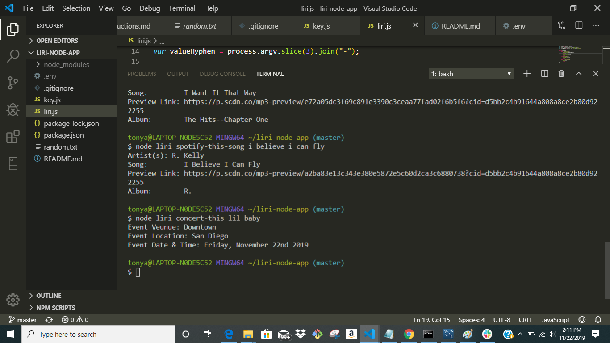

# liri-node-app

Introduction

LIRI is like iPhone's SIRI. Siri is a built-in "intelligent assistant" that enables users of Apple iPhone devices to speak natural language voice commands in order to operate the mobile device and its app.

Setup
"concert-this" Artist

"spotify-this-song" Song
Will call the Spotify API and return the first result matching the song you entered.

"movie-this" Movie
Will call the IMBD API and display the details of the movie you searched for.

"do-what-it-says

